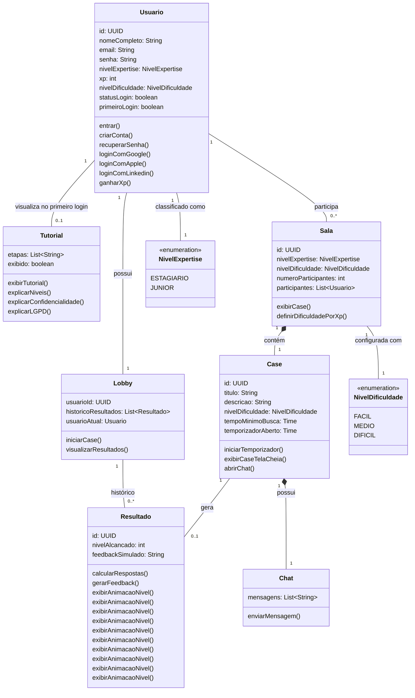

# Arquitetura do Projeto — theCoders Cases

## 1. Visão Geral

O **theCoders Cases** é um simulador de cases em grupo voltado para candidatos
iniciantes em TI (nível Estagiário e Júnior). A aplicação recria, em um ambiente
controlado e cronometrado, a dinâmica de um case técnico/comportamental em
equipe — desde o cadastro do usuário até a avaliação final de desempenho,
gerada com apoio de IA.

O fluxo principal do usuário é:

```
Cadastro/Login → Tutorial (primeiro acesso) → Lobby → Case (cronometrado) → Resultado
```

## 2. Stack Tecnológica

**Front-end**
- React (SPA)
- Vite (build e dev server)
- JavaScript
- React Router (`react-router-dom`) — navegação entre telas
- Axios — comunicação HTTP com o back-end
- ESLint — padronização de código

**Back-end / API**
> ⚠️ *A definir pela equipe — completar aqui a linguagem/framework, banco de
> dados e forma de deploy do back-end (ex: Node/Express, Python/FastAPI, etc.).
> O front-end já está preparado para consumir uma API via Axios.*

## 3. Modelo de Domínio

O modelo de domínio foi mapeado em um diagrama de classes UML (disponível em
`/docs/diagrama.png`). As principais entidades são:

### `Usuario`
Representa a pessoa candidata que usa a plataforma.

| Atributo | Tipo |
|---|---|
| id | UUID |
| nomeCompleto | String |
| email | String |
| senha | String |
| nivelExpertise | NivelExpertise (enum) |
| xp | int |
| nivelDificuldade | NivelDificuldade (enum) |
| statusLogin | boolean |
| primeiroLogin | boolean |

**Métodos:** `entrar()`, `criarConta()`, `recuperarSenha()`, `loginComGoogle()`,
`loginComApple()`, `loginComLinkedin()`, `ganharXp()`

Suporta login social (Google, Apple, LinkedIn) além do fluxo tradicional de
cadastro/recuperação de senha. O XP acumulado influencia o nível de expertise
e, consequentemente, a dificuldade dos cases oferecidos.

### `Tutorial`
Exibido automaticamente no primeiro login do usuário, apresentando as regras
da simulação.

| Atributo | Tipo |
|---|---|
| etapas | List\<String\> |
| usuarioId | UUID |
| exibido | boolean |

**Métodos:** `exibirTutorial()`, `explicarNiveis()`, `explicarConfidencialidade()`,
`explicarLGPD()`

### `Lobby` (sala de case)
Onde os participantes se reúnem antes do início do case.

| Atributo | Tipo |
|---|---|
| nivelExpertise | NivelExpertise (enum) |
| nivelDificuldade | NivelDificuldade (enum) |
| numeroParticipantes | int |
| participantes | List\<Usuario\> |

**Métodos:** `iniciarCase()`, `visualizarResultados()`, `exibirCase()`,
`definirDificuldadePorXp()`

A dificuldade do case é definida automaticamente com base no XP acumulado
pelos participantes (`definirDificuldadePorXp()`).

### `Case`
O desafio propriamente dito, cronometrado.

| Atributo | Tipo |
|---|---|
| id | UUID |
| titulo | String |
| descricao | String |
| nivelDificuldade | NivelDificuldade (enum) |
| tempoMinimoBusca | Time |
| temporizadorAberto | Time |

**Métodos:** `iniciarTemporizador()`, `exibirCaseTelaCheia()`, `abrirChat()`

### `Resultado`
Gerado ao final da simulação, com feedback de desempenho apoiado por IA.

| Atributo | Tipo |
|---|---|
| id | UUID |
| nivelAlcancado | int |
| feedbackSimulado | String |

**Métodos:** `calcularRespostas()`, `gerarFeedback()`, `exibirAnimacaoNivel()`

### Enumerações

**`NivelExpertise`**: `ESTAGIARIO`, `JUNIOR`
**`NivelDificuldade`**: `FACIL`, `MEDIO`, `DIFICIL`

### Relacionamentos principais

- `Usuario` **possui** `Tutorial` (visualizado no primeiro login)
- `Usuario` **participa** de `Lobby`
- `Usuario` **é classificado como** `NivelExpertise`
- `Lobby` **contém** `Case`
- `Case` **é configurado com** `NivelDificuldade`
- `Case` **gera** `Resultado`
- `Usuario` **possui** `Resultado`

> ⚠️ Os nomes das classes acima (`Lobby`, `Case`, `Resultado`, `Tutorial`) foram
> inferidos a partir do diagrama em `/docs/diagrama.png`. Vale a pena a equipe
> conferir rapidamente se batem com os nomes reais usados no diagrama antes da
> entrega final.

## 4. Diagrama de Classes

O diagrama completo está disponível em [`/docs/diagrama.png`](./diagrama.png).

Versão em Mermaid (útil para versionamento e leitura direto no GitHub):



## 5. Fluxo da Aplicação

1. **Cadastro/Login** — usuário cria conta ou entra via e-mail/senha ou login
   social.
2. **Tutorial** — exibido apenas no primeiro login, explica níveis, confidencialidade
   e conformidade com a LGPD.
3. **Lobby** — usuário entra em uma sala; a dificuldade do case é definida
   automaticamente pelo XP acumulado.
4. **Case** — desafio cronometrado, com chat entre participantes.
5. **Resultado** — cálculo de desempenho e geração de feedback simulado via IA,
   com animação de progressão de nível.

## 6. Decisões Técnicas

- **Vite + React**: escolhido pela velocidade de setup e HMR, adequado ao prazo
  curto do hackathon.
- **Gamificação por XP**: a progressão de dificuldade dos cases é automática,
  reduzindo fricção e mantendo o desafio alinhado ao nível real do candidato.
- **Dados fictícios**: em conformidade com o edital do hackathon (seção 8),
  todos os dados de teste utilizados na aplicação são mockados, sem captura de
  dados pessoais reais de terceiros.

> ⚠️ Completar esta seção com decisões específicas de back-end/banco de dados
> assim que definidas pela equipe.